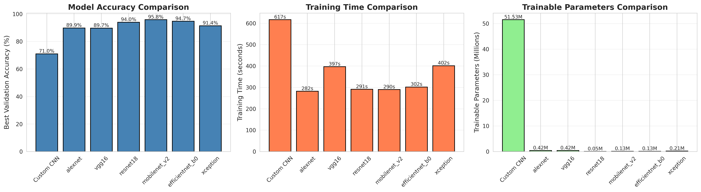
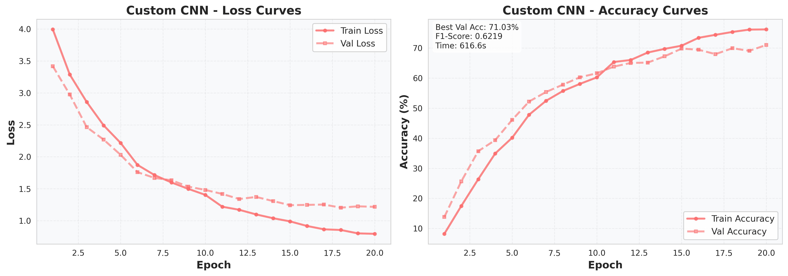
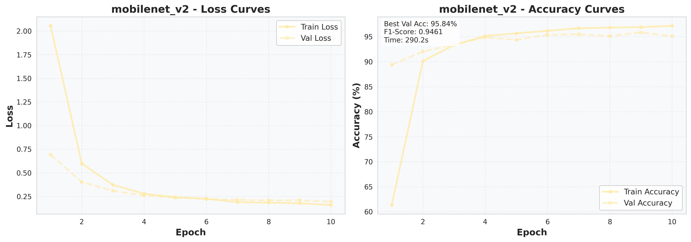
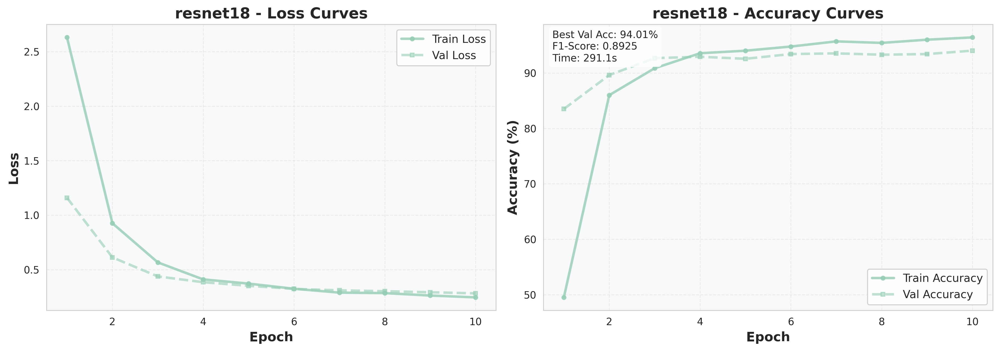
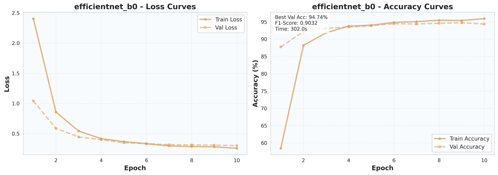
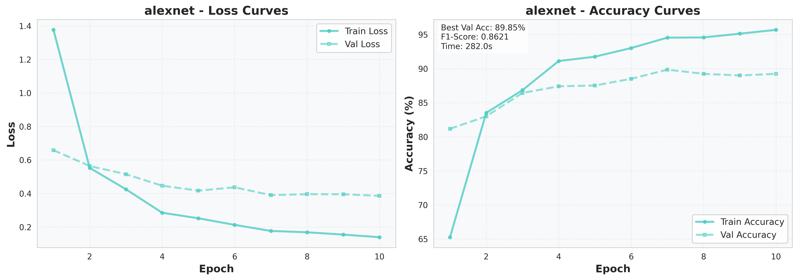
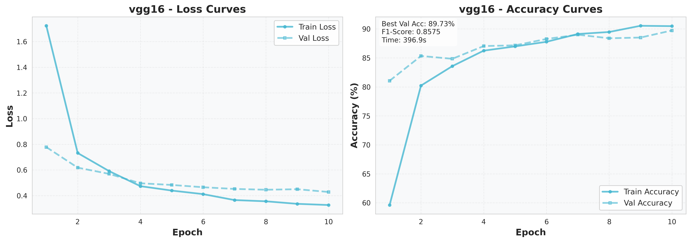
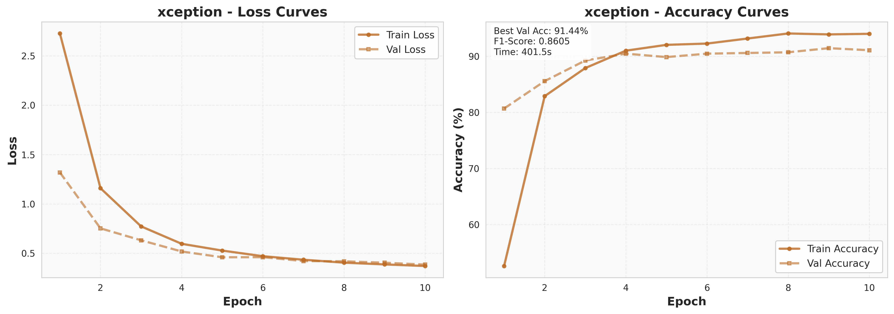

# 🌸 Flower Classification with Transfer Learning

Deep Learning approach for classifying 102 flower species using CNNs and Transfer Learning on the Oxford Flowers-102 dataset.

[](https://www.python.org/)
[](https://pytorch.org/)
[](LICENSE)

---

## 📋 Table of Contents
- [Overview](#overview)
- [Results Summary](#results-summary)
- [Model Architectures](#model-architectures)
- [Dataset](#dataset)
- [Installation](#installation)
- [Usage](#usage)
- [Visualizations](#visualizations)
- [Key Findings](#key-findings)
- [Project Structure](#project-structure)
- [Requirements](#requirements)
- [Citation](#citation)

---

## 🎯 Overview

This project implements and compares **7 different deep learning models** for flower species classification:
- **1 Custom CNN** built from scratch
- **6 Pretrained models** using transfer learning (AlexNet, VGG16, ResNet18, MobileNetV2, EfficientNet-B0, Xception)

The goal is to demonstrate the effectiveness of transfer learning compared to training from scratch, and identify the most efficient architecture for this task.

---

## 📊 Results Summary

### Performance Comparison

| Model | Accuracy (%) | F1-Score | Training Time (s) | Trainable Params |
|-------|--------------|----------|-------------------|------------------|
| **MobileNetV2** ⭐ | **95.84** | **0.9461** | 290.2 | 130,662 |
| **EfficientNet-B0** | 94.74 | 0.9032 | 302.0 | 130,662 |
| **ResNet18** | 94.01 | 0.8925 | 291.1 | 52,326 |
| **Xception** | 91.44 | 0.8605 | 401.5 | 208,998 |
| **AlexNet** | 89.85 | 0.8621 | 282.0 | 417,894 |
| **VGG16** | 89.73 | 0.8575 | 396.9 | 417,894 |
| **Custom CNN** | 71.03 | 0.6219 | 616.6 | 51,526,310 |

### Key Metrics

- 🏆 **Best Model**: MobileNetV2 (95.84% accuracy)
- ⚡ **Fastest Training**: AlexNet (282.0s)
- 🎯 **Most Efficient**: ResNet18 (94.01% with only 52K parameters)
- 📈 **Transfer Learning Advantage**: +24.8% accuracy vs custom CNN

---

## 🏗️ Model Architectures

### Custom CNN
- 3 Convolutional blocks (32 → 64 → 128 channels)
- MaxPooling after each block
- 2 Fully connected layers (512 neurons)
- Dropout (0.3) for regularization
- **51.5M parameters** (all trainable)

### Transfer Learning Models
All pretrained models use:
- **Frozen backbone** (pretrained on ImageNet)
- **Trainable final layer** (modified for 102 classes)
- **Feature extraction approach**

---

## 📦 Dataset

**Oxford Flowers-102 Dataset**
- **102 flower categories**
- **8,189 images total**
  - Training: 6,552 images
  - Validation: 818 images  
  - Test: 819 images
- Each class has 40-258 images

**Data Augmentation:**
- Random horizontal flips
- Random crops (224×224)
- Color jittering
- Normalization (ImageNet stats)

---

## 🚀 Installation

### Prerequisites
- Python 3.8+
- CUDA-capable GPU (recommended)

### Setup
```bash
# Clone repository
git clone https://github.com/NoobML/flower-classification-transfer-learning.git
cd flower-classification-transfer-learning

# Install dependencies
pip install -r requirements.txt
```

---

## 💻 Usage

### 1. Prepare Data

Download the Oxford Flowers-102 dataset and organize as:
```
data/
└── 102 flower/
    └── flowers/
        ├── test/
        ├── train/
        └── valid/
```


### 2. Train Custom CNN
```bash
python train_custom_cnn.py
```

### 3. Train Pretrained Models
```bash
python train_pretrained.py
```

### 4. Generate Visualizations
```bash
python evaluate.py
```

Results will be saved in `results/` directory.

---

## 📈 Visualizations

### Training Curves Comparison


### Model Performance Comparison



### Individual Model Performance

<details>
<summary>Click to expand individual model plots</summary>

#### Custom CNN


#### MobileNetV2


#### ResNet18


#### EfficientNet-B0


#### AlexNet


#### VGG16


#### Xception


</details>

---

## 🔍 Key Findings

### 1. Transfer Learning Dominance
- Pretrained models outperformed custom CNN by **24.8% on average**
- Even with 400× fewer trainable parameters, transfer learning achieved better results

### 2. Modern Architectures Excel
- **MobileNetV2**: Designed for mobile devices, yet achieved highest accuracy (95.84%)
- **EfficientNet-B0**: Second best with excellent parameter efficiency

### 3. Parameter Efficiency
- **ResNet18**: Best parameters-to-accuracy ratio (94.01% with only 52K trainable params)
- Custom CNN required **51.5M parameters** for only 71% accuracy

### 4. Training Speed
- Transfer learning converged in **10 epochs** vs 20 for custom CNN
- AlexNet was fastest (282s), but MobileNetV2 offered best speed-accuracy tradeoff

### 5. Architecture Insights
- Older architectures (AlexNet, VGG16) still performed well but required more parameters
- Xception underperformed expectations (91.44%) despite complexity

---

## 📁 Project Structure
```
flower-classification-transfer-learning/
│
├── configs/
│   └── config.py                 # Hyperparameters and settings
│
├── models/
│   ├── __init__.py
│   ├── custom_cnn.py            # Custom CNN architecture
│   └── pretrained_models.py     # Pretrained model loader
│
├── utils/
│   ├── __init__.py
│   ├── data_loader.py           # Data loading and augmentation
│   ├── training.py              # Training loops
│   ├── evaluation.py            # F1-score calculation
│   └── visualization.py         # Plotting functions
│
├── results/
│   ├── plots/                   # Generated visualizations
│   └── metrics.json             # Training metrics
│
├── train_custom_cnn.py          # Train custom CNN
├── train_pretrained.py          # Train all pretrained models
├── evaluate.py                  # Generate plots and analysis
├── requirements.txt             # Dependencies
├── flower-classification-transfer-learning.ipynb  # Notebook
└── README.md                    # This file
```

---

## 📦 Requirements
```
torch>=2.0.0
torchvision>=0.15.0
timm>=0.9.0
matplotlib>=3.7.0
seaborn>=0.12.0
scikit-learn>=1.3.0
numpy>=1.24.0
Pillow>=9.5.0
```

---

## 🎓 Citation

If you use this code for your research, please cite:
```bibtex
@misc{flower-classification-2025,
  author = {NoobML},
  title = {Flower Classification with Transfer Learning},
  year = {2026},
  publisher = {GitHub},
  url = {https://github.com/NoobML/flower-classification-transfer-learning}
}
```

**Dataset Citation:**
```bibtex
@InProceedings{Nilsback08,
  author = "Nilsback, M-E. and Zisserman, A.",
  title = "Automated Flower Classification over a Large Number of Classes",
  booktitle = "Indian Conference on Computer Vision, Graphics and Image Processing",
  year = "2008",
}
```

---

## 📝 License

This project is licensed under the MIT License - see the [LICENSE](LICENSE) file for details.

---

## 🤝 Contributing

Contributions are welcome! Please feel free to submit a Pull Request.

---

## 📧 Contact

For questions or feedback, please open an issue on GitHub.

---

## 🙏 Acknowledgments

- Oxford Flowers-102 dataset creators
- PyTorch and timm library contributors
- Transfer learning research community

---

**⭐ If you find this project helpful, please consider giving it a star!**